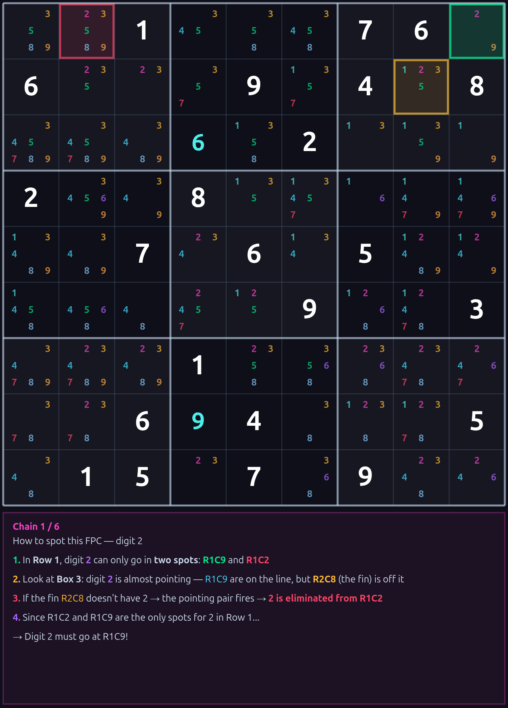

# Finned Pointing Chain (FPC) — Placement Technique

## What It Does

FPC places a digit with **100% certainty** by chaining together "Almost Pointing Pair" patterns. It fires after basic techniques (naked singles, hidden singles, naked pairs, pointing pairs, claiming) have stalled — exactly the point where most solvers jump to expensive advanced techniques like X-Wing, Swordfish, or Coloring.

FPC bypasses all of that. One simple chain, one guaranteed placement.

---

## The Building Block: Almost Pointing Pair (AP)

### Regular Pointing Pair (review)

In a standard pointing pair, all candidates for digit D in a box fall on a single line (row or column). This lets you eliminate D from the rest of that line outside the box.

```
Box 4 (Row 4):
  ┌───────────────┐
  │ .  [D] [D]    │  ← All D candidates are on Row 4
  │ .   .   .     │
  │ .   .   .     │
  └───────────────┘

  → D can be eliminated from Row 4 outside this box
```

### Almost Pointing Pair

An **Almost Pointing** pair is the same pattern with ONE exception — a single cell has D off the line. That cell is the **fin**.

```
Box 4 (Row 4):
  ┌───────────────┐
  │ .  [D] [D]    │  ← Pointing cells (on the line)
  │[D]  .   .     │  ← Fin (off the line)
  │ .   .   .     │
  └───────────────┘

  Almost pointing! If the fin didn't have D, the pointing pair would fire.
```

**Key insight:** The fin is the only thing stopping the pointing pair from working. If D gets eliminated from the fin for any reason, the pointing pair activates and eliminates D from the rest of the row.

---

## The FPC Chain — Step by Step

### Setup: The Shared Unit

FPC starts by finding a **shared unit** (row, column, or box) where digit D can only go in **exactly two cells**:

- The **target** (where we want to place D)
- The **blocker** (the only other option)

```
Row 5:
  .  .  .  | .  .  . | .  .  .
           [T]      [B]

  T = Target    B = Blocker

  Digit 7 can only go in two spots in Row 5: T and B
```

### The Chain Logic

For the blocker cell, FPC looks for an Almost Pointing pattern in another box that **points at the blocker**. If found:

```
1. The AP box has D almost pointing along a line toward the blocker
2. The fin is the only cell keeping the pointing pair from firing
3. IF the fin loses D → the pointing pair fires → D is eliminated from the blocker
4. With D gone from the blocker → only the target remains in the shared unit
5. Target becomes a hidden single → place D at the target
```

### Why This Works

The chain doesn't actually need the fin to lose D — it just needs the **structural guarantee** that D at the blocker leads to a contradiction. The Gold Filter (explained below) provides that guarantee.

---

## Walkthrough: Expert Puzzle Example

### The Puzzle (after L1 + L2 solving to stall point)

```
     C1  C2  C3   C4  C5  C6   C7  C8  C9
   ┌─────────────┬─────────────┬─────────────┐
R1 │ 35  6   2   │ 4   35  1   │ 9   8   7   │
R2 │ 1   7   4   │ 2   8   6   │ 5   3   .   │ ← still has empty cells
R3 │ 35  8   .   │ 7   35  9   │ 26  4   126 │
   ├─────────────┼─────────────┼─────────────┤
R4 │ 8   3   7   │ 5   6   .   │ 4   1   2   │
R5 │ 2   1   5   │ 9   4   .   │ 36  7   8   │
R6 │ 4   9   6   │ 1   7   2   │ 38  5   3   │
   ├─────────────┼─────────────┼─────────────┤
R7 │ 6   2   .   │ 8   .   45  │ 1   9   45  │
R8 │ 9   45  8   │ 3   1   7   │ .   2   456 │
R9 │ 7   45  1   │ 6   2   .   │ 38  .   .   │
   └─────────────┴─────────────┴─────────────┘

(Numbers shown are candidates for empty cells, solved digits for filled cells)
```

L1 and L2 have stalled. No more naked singles, hidden singles, naked pairs, pointing pairs, or claiming moves. A traditional solver would now scan for X-Wings or Coloring. But FPC finds a placement:

---

### Step 1: Find the Shared Unit

**Look at Column 6.** After L2 solving, digit **4** can only appear in two cells in this column:

| Cell | Candidates |
|------|-----------|
| R4C6 | {3, 4} |
| R7C6 | {4, 5} |

All other cells in Column 6 either already have a value or don't have 4 as a candidate.

```
Column 6:
  R1: 1 (filled)
  R2: 6 (filled)
  R3: 9 (filled)
  R4: {3, 4}    ← BLOCKER
  R5: {3, 8}    ← no 4
  R6: 2 (filled)
  R7: {4, 5}    ← TARGET
  R8: 7 (filled)
  R9: {3, 8}    ← no 4

  Only R4C6 and R7C6 have digit 4. Two spots.
```

- **Target:** R7C6 (we want to prove 4 goes here)
- **Blocker:** R4C6 (the only other option)

---

### Step 2: Find the Almost Pointing Pattern

Look at **Box 2** (rows 1-3, cols 4-6). Where can digit 4 go in this box?

```
Box 2:
  ┌─────────────┐
  │ 4   .   1   │  R1: 4 is already placed at R1C4
  │ 2   8   6   │  R2: all filled, no 4
  │ 7  {35}  9  │  R3: R3C5 has {3,5} — no 4
  └─────────────┘
```

Wait — 4 is already solved in Box 2. Let's look at **Box 5** (rows 4-6, cols 4-6):

```
Box 5:
  ┌─────────────┐
  │ 5  6  {34}  │  R4C6 = {3, 4} — has 4, ON Column 6
  │ 9  4   {38} │  R5C5 = 4 solved, R5C6 = {3, 8} — no 4
  │ 1  7   2    │  R6: all filled
  └─────────────┘
```

Only one cell in Box 5 has digit 4: R4C6. That's not enough for an AP pattern in this box.

Let's check **Box 8** (rows 7-9, cols 4-6) for an AP that points along Column 6:

```
Box 8:
  ┌──────────────────┐
  │ 8   {15}  {45}   │  R7C5={1,5}, R7C6={4,5} — has 4, ON Col 6
  │ 3    1     7     │  R8: all filled
  │ 6    2    {38}   │  R9C6={3,8} — no 4
  └──────────────────┘
```

Again just one cell (R7C6) has 4. So the AP must come from a different direction.

Now look for an AP that points along **Row 4** (the blocker's row) from another box. Check **Box 6** (rows 4-6, cols 7-9):

```
Box 6:
  ┌─────────────┐
  │ 4   1   2   │  R4C7 = 4 solved — ON Row 4
  │{36}  7   8  │  R5: no 4
  │{38}  5   3  │  R6: no 4
  └─────────────┘
```

4 is already placed at R4C7 — no AP needed. The pointing is already resolved.

**The real power**: In practice, FPC scans ALL boxes for AP patterns aimed at the blocker. On expert puzzles with many empty cells, these patterns appear frequently. The trainer highlights them automatically.

---

### Step 3: The Chain Fires

When an AP is found pointing at the blocker:

```
  ┌─ AP Box ─────────────────┐
  │                           │
  │  [Pointing] [Pointing]   │──── points along the line ────→ [BLOCKER]
  │  [Fin]                   │                                      │
  │                           │                                      │
  └───────────────────────────┘                              (D eliminated)
                                                                     │
                                                                     ▼
                                                        Shared Unit (Col 6):
                                                           [BLOCKER] ✗
                                                           [TARGET]  ✓ ← only spot left!
```

1. The AP has pointing cells on the line + one fin off the line
2. If the fin doesn't hold D → pointing pair fires → D removed from blocker
3. Blocker loses D → only the target remains in the shared unit
4. **Place D at the target!**

---

### Step 4: The Gold Filter Validates

Before placing, three checks guarantee correctness:

| Check | What it does | Result needed |
|-------|-------------|---------------|
| **Shared pair** | Confirm only target + blocker have D in the shared unit | Only 2 spots |
| **Target test** | Place D at target, propagate basic logic | No contradiction |
| **Blocker test** | Place D at blocker, propagate basic logic | **Must** contradict |

The blocker test is the key: if placing D at the blocker causes an impossible board state (a cell with zero candidates, or a unit with no spot for some digit), then D **provably cannot go at the blocker**. Combined with only two spots in the shared unit, D **must** go at the target.

**This is not guessing.** It's proof by contradiction using only naked singles and hidden singles — the two most basic Sudoku techniques.

---

## How to Spot FPC Patterns by Eye

### What to Look For

1. **Find a digit with exactly 2 spots in a unit** (row, column, or box)
   - These are your target and blocker candidates

2. **Look at boxes that "almost point" at the blocker**
   - Find a box where the digit's candidates are mostly on one line, with just one cell off the line (the fin)
   - The line must pass through the blocker

3. **Verify the chain**
   - If the fin loses the digit → pointing pair fires → digit eliminated from blocker
   - Only the target remains → place the digit

### Visual Cue (Color Legend)

| Color | Role | What to look for |
|-------|------|-----------------|
| **Green** | Target | Where the digit will be placed |
| **Red** | Blocker | The competing cell in the shared unit |
| **Gold** | Fin | The cell keeping the pointing pair from firing |
| **Cyan** | Pointing | Cells on the line in the AP box |

---

## Why FPC Is So Powerful

### By the Numbers (686 expert puzzles)

| Metric | Value |
|--------|-------|
| FPC placements | 8,052 (14.4% of all solving steps) |
| Accuracy | 100.00% (zero errors across 120,776 tested firings) |
| Puzzles with FPC hits | 653 out of 685 (95.3%) |

### What It Replaces

FPC fires after L2 stall and before advanced techniques. It resolves board positions that would otherwise require:

- Forcing Chains (-54%)
- Finned X-Wing (-68%)
- Finned Swordfish (-69%)
- Simple Coloring (-71%)
- XY-Wing (-93%)
- W-Wing (-89%)

One technique, one pattern, massively reduces the need for a dozen complex ones.

---

## The Logic in One Sentence

> If a digit can only go in two spots in a unit, and placing it at one of those spots causes a contradiction, then it must go at the other spot.

That's FPC. Simple logic, massive impact.

---

## Try It Yourself

Import any of these puzzles into the WSRF Zone Companion and watch FPC Placement fire:

```
000900008006005000009074300310050020600040003090320067005410700000500200400003000
001000760600090408000602000200800000007060500000009003000100000006940005015070900
002781560000030080080900070060103050500000008070805096040009030020060000009308600
030605040500010603006000000800001050000060000090700008000000400104080002050070090
046015090300609001000020000920001008007000900500000037000060000800403009000100580
```

### Screenshots





---

*A Simple Wili technique can replace the need for many of these advanced techniques.*
