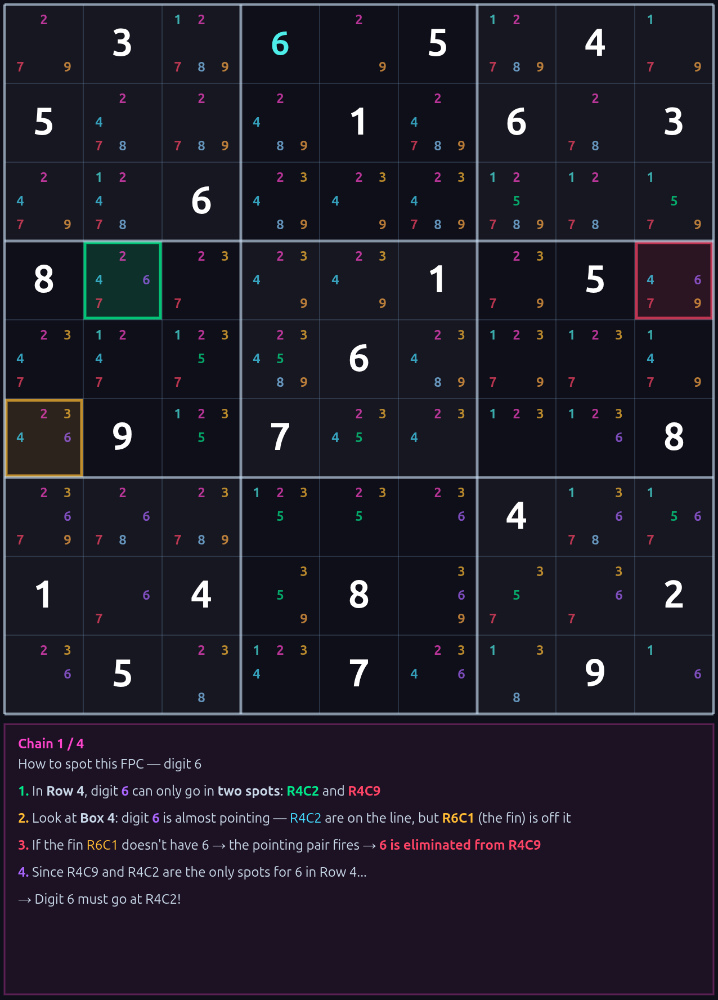
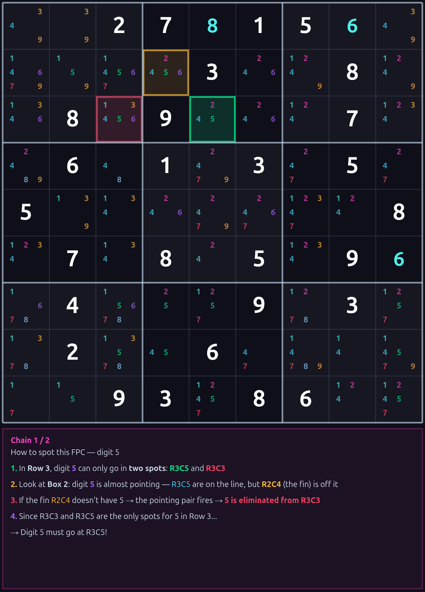

# Simple Wili's Sudoku Solved Series!

Two techniques that changed how we solve expert Sudoku. No memorizing complex fish patterns. No coloring chains. No ALS gymnastics. Just pure, simple logic that clears the board.

---

## The Techniques

### FPC Placement (Finned Pointing Chain)

**What it does:** Places digits with 100% certainty by chaining "Almost Pointing Pair" patterns.

**The idea:** If a digit can only go in two spots in a row/column/box, and placing it at one of those spots causes a contradiction... it must go at the other spot.

**How it works:**
1. Find a unit where digit D has exactly 2 remaining spots (target + blocker)
2. Find an Almost Pointing pattern in another box that aims at the blocker
3. The Gold Filter validates: blocker placement contradicts, target placement is safe
4. Place the digit at the target. Done.

| Stat | Value |
|------|-------|
| Accuracy | **100.00%** (verified on 120,776 firings) |
| Coverage | 653 / 685 expert puzzles (95.3%) |
| Share of solving steps | 14.4% |

> Read the full technique: [FPC_Placement_Technique.md](FPC_Placement_Technique.md)

---

### FPC Elimination (FPCE)

**What it does:** Eliminates candidates using proof by contradiction. For each candidate in each cell: assume it's true, propagate naked + hidden singles forward. If the board breaks, eliminate it.

**The idea:** If placing a digit somewhere and following basic Sudoku logic leads to an impossible board state, that digit can never go there.

**How it works:**
1. Pick the most constrained cells first (fewest candidates)
2. For each candidate, place it and cascade naked singles + hidden singles
3. If a cell hits zero candidates or a unit loses a digit — contradiction
4. Eliminate that candidate. The board simplifies. L1 techniques take over.

| Stat | Value |
|------|-------|
| Share of solving steps | **21.7%** (#1 technique in the solver) |
| Combined with FPC Placement | **36.1%** of all steps |
| Techniques made obsolete | **13+** (see below) |

> Read the full technique: [FPC_Elimination_Technique.md](FPC_Elimination_Technique.md)

---

## What FPCE Replaced

These techniques are effectively gone from the solving pipeline:

| Technique | Status |
|-----------|--------|
| X-Wing | Gone |
| Swordfish | Gone |
| Finned X-Wing | Gone |
| Finned Swordfish | Gone |
| Simple Coloring | Gone |
| XY-Wing | Gone |
| XYZ-Wing | Gone |
| W-Wing | Gone |
| ALS-XZ | Gone |
| ALS-XY-Wing | Gone |
| AIC | Gone |
| Hidden Pair | Gone |
| Naked Quad | Gone |
| Naked Triple | -82% |
| Forcing Chain | -71% |

One principle — proof by contradiction using only naked and hidden singles — replaces a dozen specialized pattern-matching techniques.

---

## Results on 686 Expert Puzzles

```
Fully Solved:     686 / 686 (100.0%)
Pure Logic:       430 / 686
FPC Placement:    8,052 firings (14.4%)
FPC Elimination:  12,160 firings (21.7%)
Combined:         20,212 firings (36.1% of all steps)
Oracle breaks:    0
```

---

## The Discovery

It started with a broken technique. FPC Placement was causing ~50% oracle breaks across 686 puzzles. The user's insight: *"if it's exactly 50/50 that is the best result ever — there must be a pattern to distinguish!"*

Diagnostic analysis of 120,776 FPC firings revealed a perfect binary separator — the **blocker cell**. If the blocker's solution value is D, the chain is always wrong. If not, always right. 100% / 0% split.

The **Gold Filter** was born: three observable checks (shared pair + target consistency + blocker contradiction) that achieve 100.00% accuracy without looking at the solution.

Then the generalization: if contradiction testing works for blockers, it works for **any cell**. FPC Elimination was born — and immediately became the #1 technique in the solver, making 13+ advanced techniques obsolete.

The journey: **broken technique (50%) → diagnostic analysis → Gold Filter (100%) → generalized elimination → #1 technique.**

---

## Screenshots

### FPC Placement — Chain Visualization

| | |
|---|---|
|  | .png) |
| .png) | .png) |
|  |  |
|  |  |

### FPCE Elimination — Propagation Cascade & Contradiction

| | |
|---|---|
|  |  |

---

## Tools

Built with the **WSRF Zone Companion** solver — a browser-based Sudoku analysis engine featuring:
- FPC + FPCE trainers with interactive step-by-step walkthroughs
- Color-coded board highlighting (target, blocker, fin, pointing, cascade, contradiction)
- Full batch solving across 686 expert puzzles
- PNG export with board state + trainer walkthrough

---

*Why use all those hard techniques when you can clear the board with Simple Wili?*
