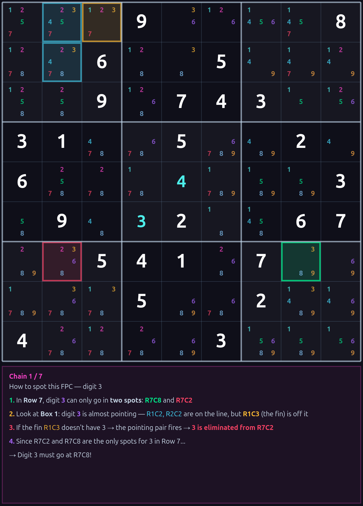
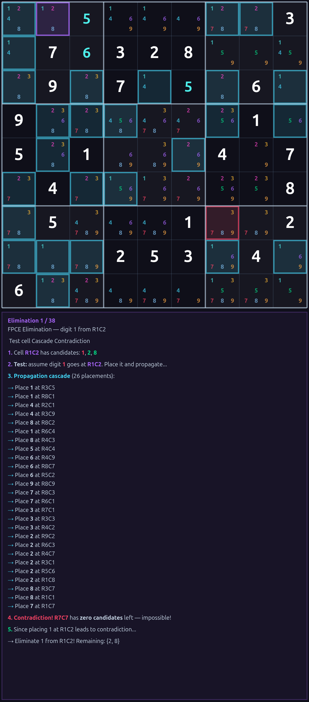
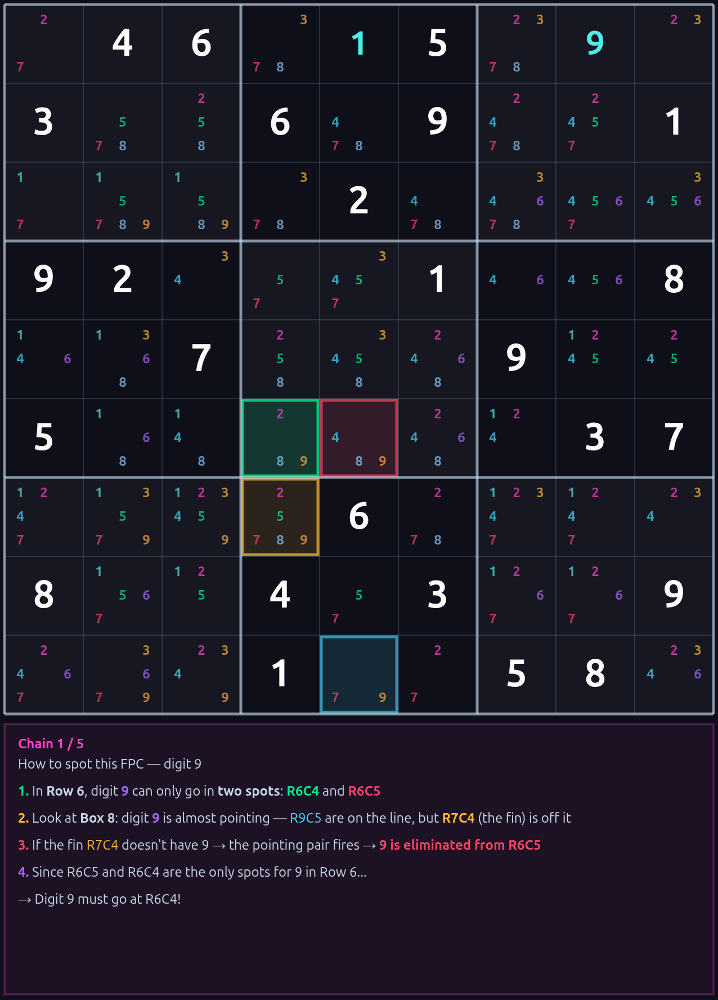
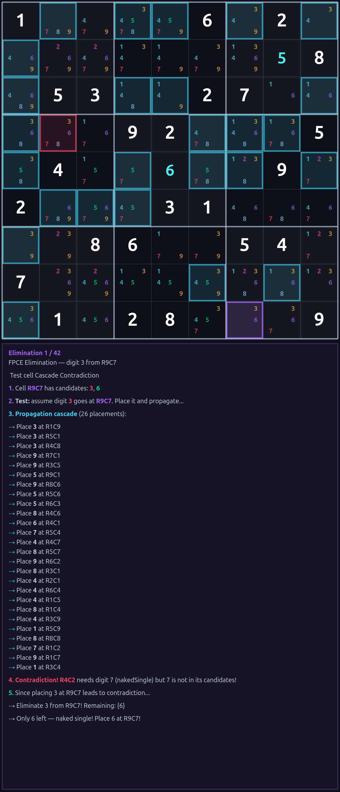
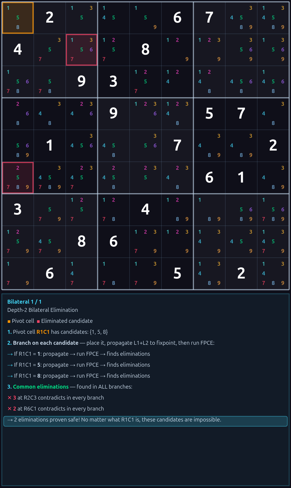
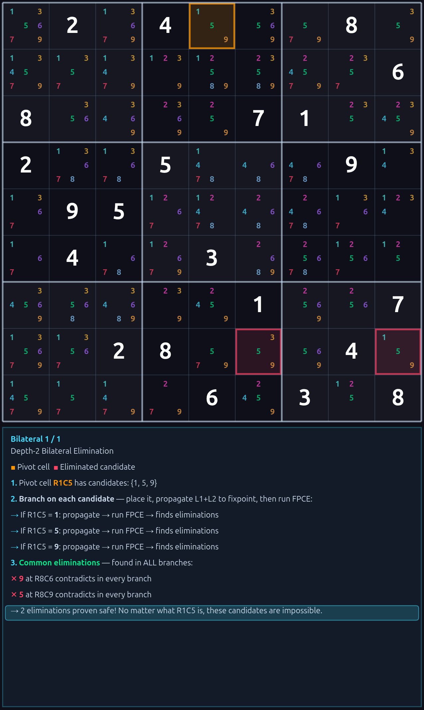
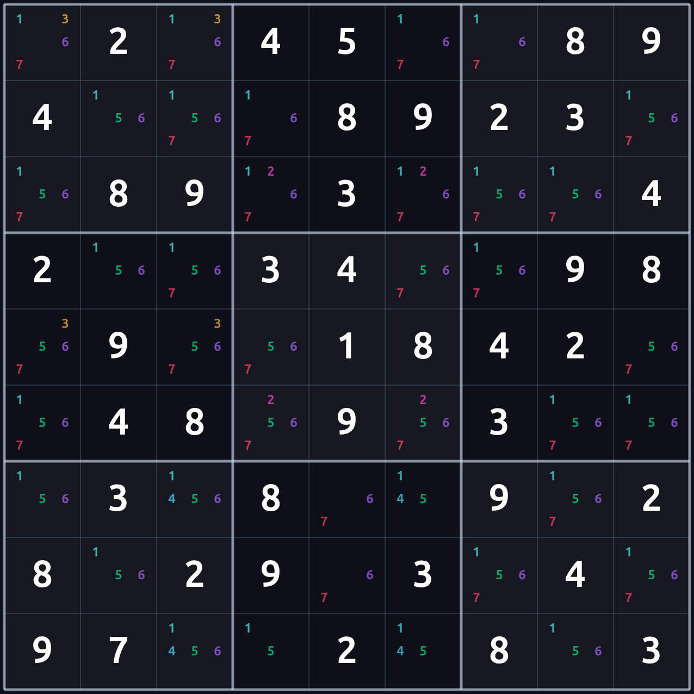
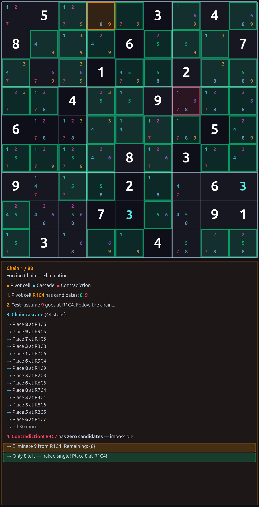
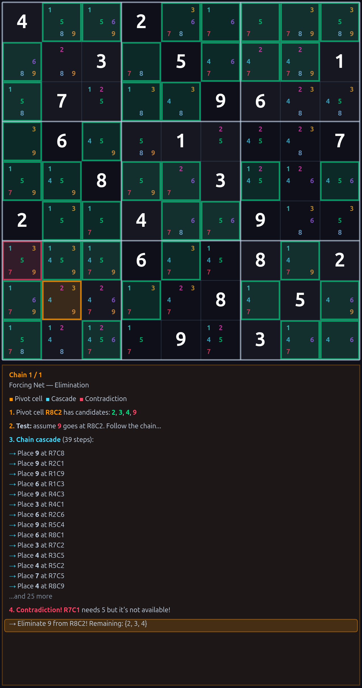

# Hunting New Sudoku Techniques with larsdoku + AI

```
# 99.91% on the 48k hardest !

https://larsdoku.netlify.app/

https://larsdoku.netlify.app/larsdoku_deploy_hypersiro/

```

A research guide for joining the party.

larsdoku 3.4.8 is a pure-logic sudoku solver with 44 pattern detectors. It is
also a research instrument: when you give it a hard puzzle and it stalls, the
stall is a **fingerprint of a technique nobody has named yet**. This guide
shows you how to install it, run it in research mode, and use any AI assistant
(Claude, ChatGPT, etc.) to help cluster the stall fingerprints into a real,
publishable new technique.

The methodology described here is the same one used to discover six WSRF
techniques already in the solver: **FPC, FPCE, D2B, FPF, DeepResonance, and
LZWing**.

---

## Why this is interesting

Every named sudoku technique — from naked single up through Junior Exocet —
was once an unnamed pattern someone noticed. The pattern came first, the
name and the proof came later.

larsdoku gives you a way to find those patterns at scale:

1. Run thousands of hard puzzles through the standard 44-detector chain.
2. When the chain stalls, use **WSRF zone math** (a rank-1 cell oracle from
   the Self-Informing Rank Oracle / SIRO system) to nudge the puzzle past
   exactly one cell.
3. Record where the nudge happened — the cell, the zone slot, and the board
   state at that moment.
4. Cluster the recordings across the corpus. Cells that share a structural
   shape are candidates for the same undiscovered technique.

Step 2 sounds magical but it is not — it is a deterministic prediction
based on row/column/box rank statistics, validated against the backtracker
solution at every step (so you know the nudge is correct without trusting
it blindly). The point of the nudge is **not to solve the puzzle**, it is
to mark the location of the gap in a way that lets you compare gaps across
many puzzles.

---

## Install

```bash
pip install larsdoku==3.4.8

# Don't forget this step after every upgrade, because it increses speed by 1000%!!!

larsdoku --warmup

```

Or, for the bleeding-edge build:

```bash
git clone <repo>
cd larsdoku
pip install -e .
```

Verify:

```bash
larsdoku --version
# larsdoku 3.4.8
```

---

## Solve a puzzle the normal way

```bash
larsdoku '1.3..67.9.57..9.3669...351..6584..............71.......1.9...75......3......6.9.1' --level 7
```

You will see the technique cascade. `--level 7` enables every detector
(L1-L7); the default `--level 99` is the same as 7 plus oracle-only
techniques.

---

## Solve a puzzle in research mode

This is the new flag in 3.4.8:

```bash
larsdoku '12..56.89.5...92.6......15.2.1...96..65....2889....5.1....7..........81..1283....' --with-zoneded --level 7 --verbose
```

Output:

```
[zd-loop] round 1: remaining=50
[zd-loop]   wrong placement R2C3=8 (truth=7) — abort technique cascade
[zd-loop]   placed 1, result.steps=46, result.success=False, remaining_after=49
  ★ ZONE DEDUCTION #1 (round 1): R1C7=7  zone=TL  [CROSS-DIGIT]
[zd-loop] round 2: remaining=48
[zd-loop]   placed 48, result.steps=48, result.success=True, remaining_after=0

Status: SOLVED
Technique steps: 49
Zone deductions: 1
|Zones: TL|
...
Zone Deduction Points (technique gaps — research signal):
  #1: R1C7=7  zone=TL  [cross-digit]  (stall round 1) — missing technique here
```

The important line is the last one. It tells you:

- **Cell:** R1C7 — row 1, column 7
- **Zone:** TL — this cell's slot inside its 3x3 box (top-left)
- **Subtype:** cross-digit — which family of zone oracle fired
- **Stall round:** 1 — how many technique rounds had completed before
  the stall

The `|Zones: TL|` line is a grep-friendly array of every zone slot used in
this puzzle, in order. If a puzzle needed two deductions you would see
something like `|Zones: TL,MC|`.

---

## What "zone" means here

Each 3x3 box has 9 cells. The WSRF system labels each cell by its position
**inside its own box**, giving 9 zone names:

```
TL TC TR     ← Top-Left, Top-Center, Top-Right of the box
ML MC MR     ← Middle-Left, Middle-Center, Middle-Right
BL BC BR     ← Bottom-Left, Bottom-Center, Bottom-Right
```

There are nine cells with each label across the whole grid (one per box).
Treating them as a single group is the WSRF idea: the centers (MC) form one
group, the top-rights (TR) form another, and so on. Many discovered
techniques act on relationships within or between these groups.

When the research output says `zone=TR`, it means the cell where the
deduction landed is the top-right cell of its 3x3 box. Across a corpus you
will find that some zones appear far more often than others — that
asymmetry is a real research signal, not noise.

---

## Run a whole corpus

For batch research, use the supplied script (adjust the input/output
paths at the top of the file to match your local puzzle corpus):

```bash
python mith_158k_solve.py
```

It writes one line per puzzle to `mith_larsdoku_new_solve.txt`:

```
puzzle_number|puzzle|status|kind|empty_remaining|zones|technique_counts
```

Where `kind` is one of:

- `-`       — solved by techniques alone (no zone help needed)
- `Zoned`   — solved but needed at least one zone deduction
- `Stalled` — stuck even with zone deductions
- `Failed`  — exception during solve

And `zones` is a comma-separated list like `TL,MC` of every zone slot used,
or `-` if none.

Grep recipes:

```bash
# All puzzles that needed zone help (the research material)
grep "|true|Zoned|" mith_larsdoku_new_solve.txt

# Puzzles that stalled even with zone help (rarer, harder)
grep "|Stalled|" mith_larsdoku_new_solve.txt

# Puzzles that needed a TR-zone deduction
grep "|Zoned|.*|TR" mith_larsdoku_new_solve.txt | head

# Puzzles needing exactly two deductions
grep "|Zoned|.*|.*,.*|" mith_larsdoku_new_solve.txt
```

---

## Reading the corpus stats

After running a batch, you can count how often each zone appears:

```bash
awk -F'|' '$6 != "-" {
    n = split($6, zs, ",")
    for (i=1; i<=n; i++) cnt[zs[i]]++
}
END {
    for (z in cnt) printf "  %-3s  %5d\n", z, cnt[z]
}' mith_larsdoku_new_solve.txt | sort -k2 -rn
```

A non-uniform distribution is a finding. From a recent 559-puzzle slice of
the mith corpus:

```
    TR   450  24.4%
    TC   389  21.1%
    TL   356  19.3%
    MR   198  10.7%
    MC   152   8.3%
    ML   112   6.1%
    BC    91   4.9%
    BR    48   2.6%
    BL    47   2.6%    
```

The top row (TL+TC+TR) holds 58.7% of the deductions. That is not random.
It is structural information about either the puzzle generator or the
detectors — and it tells you where to look for the next technique.

---

## The five steps to a new technique

1. **Run a corpus** (a few thousand puzzles is plenty to start) with
   `mith_158k_solve.py` or similar.
2. **Filter to one zone class** — say, all puzzles where a TR deduction
   was needed. Often the gap shape is different per zone.
3. **Reconstruct the board state** at the stall for each puzzle. (See the
   "Replaying a stall" recipe below.)
4. **Look for a shared structural pattern** in those board states. Common
   things to check: constraint groups around the stall cell, candidate
   parities, peer-clique shapes, restricted commons.
5. **Formalise the pattern** as a rule, validate it on a held-out batch,
   write it up, ship it.

This is the loop that produced FPC, FPCE, D2B, FPF, DeepResonance, and
LZWing. Each one started as a cluster of stall fingerprints and ended as
a sound, named technique with a 3-coloring proof.

---

## Replaying a stall

If you have a puzzle from the corpus you want to inspect, just rerun it
in verbose mode:

```bash
larsdoku '<the puzzle>' --with-zoneded --level 7 --verbose
```

The `--verbose` output shows you exactly which cells the technique chain
placed before stalling, and at which round. Combine with `--steps` for
even more detail.

To dump the candidate board at a specific stall point, the easiest path
right now is:

```python
from larsdoku.engine import BitBoard, solve_backtrack
from larsdoku.cli import solve_selective

p = '<your puzzle>'
sol = solve_backtrack(p)
sol_list = [int(c) for c in sol]
bb = BitBoard.from_string(p)

# Run techniques up to (but not past) the stall
result = solve_selective(p, max_level=7)
for step in result['steps']:
    pos, digit = step['pos'], step['digit']
    if sol_list[pos] != digit:
        break  # this is where corruption / stall begins
    bb.place(pos, digit)

# bb is now the stall-point board. Inspect bb.cands[i] for candidates
# at each cell, bb.board[i] for placed digits.
for r in range(9):
    print(' '.join(str(bb.board[r*9+c]) if bb.board[r*9+c] else '.' for c in range(9)))
```

---

## Using AI as your research partner

The pattern-finding step is where an AI assistant earns its keep. Here are
prompts that work.

### Prompt 1 — clustering

Paste a handful of stall-point boards into the chat with this prompt:

> I have N sudoku puzzles where larsdoku's full L1-L7 technique chain
> stalls, and a SIRO zone deduction at zone slot TR breaks the stall every
> time. Below are the candidate boards at the stall point for ten of these
> puzzles. The cell that needed the zone deduction is marked with a star.
> What structural pattern do these boards share around the starred cell?
> List specific things to check, ranked by how strongly they appear in the
> sample.

The AI will not always nail it on the first try. Iterate: after it lists
candidates, give it a smaller second sample and ask which of its candidate
patterns hold up.

### Prompt 2 — proving soundness

Once you have a candidate rule, ask:

> Here is a proposed sudoku elimination rule: <rule>. Construct a
> 3-coloring argument for it: assign colors to the cells named in the
> rule, list the unit constraints between them, and check whether any
> consistent coloring leaves the eliminated digit alive at the target.
> If yes, the rule is unsound — show me the witness assignment. If no,
> walk me through the forced contradiction.

This is the same check `WXYZ_CASE_STUDY.md` walks through manually for the
WXYZ-Wing heuristic. **Do this step before claiming a new technique is
sound.** The history of larsdoku's WXYZ-Wing — which is unsound on a
documented 12% of fires — is a reminder that benchmark performance does
not equal soundness.

### Prompt 3 — implementation sketch

> Here is a sound rule for sudoku eliminations: <rule>. Sketch a Python
> detector that finds all instances of this pattern on a 9x9 candidate
> bitboard. The interface should match larsdoku's existing detectors:
> `def detect_<name>(bb): return list of (pos, digit) eliminations`.
> Optimize for clarity first, speed second.

You will iterate on the sketch a few times. That is fine. The goal of the
AI prompt is to get a working draft fast, not to skip code review.

### What to share with the AI, and what not to

Share liberally:
- Puzzle strings (these are public data)
- Candidate boards and stall points
- Technique fire logs
- Your hypothesis and counter-examples

Do not share:
- Production code outside the public larsdoku source tree
- Private benchmarks or unpublished puzzle generators

### Verifying AI output

Every AI suggestion gets verified two ways before it touches the codebase:

1. **Manual 3-coloring check** on at least three positive examples and
   three negative examples (where the rule fires but the elimination is
   wrong). The wxyz case study has the template.
2. **Automated test** against a held-out corpus with the
   `trust_solution=` path of `solve_selective` (which blocks unsound
   eliminations and reports them so you know exactly which fires were
   wrong).

If both checks pass, the rule is real and you can write it up.

---

## Sharing your findings

When you find a candidate technique, the format that works best is a
short markdown file with these sections:

1. **Name** and one-sentence description
2. **Pattern definition** — formal statement of what counts as an instance
3. **Soundness proof** — the 3-coloring argument
4. **Examples** — 3 sound positive cases (rule fires, elimination correct),
   3 controlled negative cases (rule does not fire here, and why)
5. **Coverage** — how often it fires on a named corpus and how many
   puzzles it newly solves vs. the existing chain
6. **Comparison to existing techniques** — does it subsume any? Is it
   subsumed by any?

`LZWING_PAPER.md` and `WXYZ_CASE_STUDY.md` in this repository are
worked examples of this format.

Submit findings as a pull request, an issue with the markdown attached,
or just an email — whichever is easiest.

---

## Good first PRs (known gaps)

If you're looking for a smaller, well-specified contribution to warm
up on before hunting new techniques, the larsdoku L2 detector layer
is missing three standard textbook subset rules. They're documented
in every solver reference, sound by construction (no 3-colouring
needed — they follow directly from pigeonhole), and their absence
is a small but real coverage gap.

| Missing | Dual of | Where it would live |
|---|---|---|
| **Hidden Triple** | Naked Triple | `src/larsdoku/engine.py` `apply_l2_bitwise`, next to `Hidden Pairs` (around line 1057) |
| **Hidden Quad** | Naked Quad | same function, just below Hidden Triple |
| **Naked Quad** | Naked Triple (size-4 generalization) | same function, next to `Naked Triples` (around line 938) |

The docstring at `engine.py:19` claims Naked Quad is implemented;
it isn't. The header comment is the only evidence it ever existed.

**Reference rules** (Andrew Stuart's SudokuWiki):

- *Naked Quad*: four cells in a unit whose candidate union has
  exactly four digits. Eliminate those four digits from every other
  cell in the unit.
- *Hidden Triple*: three digits whose appearances in a unit are
  confined to exactly the same three cells. Eliminate every *other*
  digit from those three cells.
- *Hidden Quad*: same idea, four digits in four cells.

**How to verify your implementation:**

1. Add the detector to `apply_l2_bitwise` next to its sibling.
2. Run `larsdoku '<a known hidden-triple puzzle>' --level 7 --steps`
   and confirm the elimination fires.
3. Re-run the curated benchmarks (Weekly Expert 686, Forum Hardest
   11+ first 2500) and confirm no regressions: 686/686 and
   2498+/2500 should both hold.
4. Run the soundness audit script if you want belt-and-braces — a
   sound L2 addition will produce zero root-cause truth kills.

This is roughly a 30–60 minute task per detector and a fine
on-ramp for the rest of the codebase.

---

## Honesty notes

- **Zone deductions are not magic.** They are skip-oracle validated rank-1
  predictions. They are only as trustworthy as the backtracker that
  validates them.
- **A high zone-deduction count is not a quality signal.** It just means
  the standard chain has gaps in that puzzle. Some puzzles need many
  deductions; some need none.
- **The TR/TC dominance in the mith corpus is not yet explained.** It
  could be a generator artefact, a detector blind spot, a rank-1 cache
  bias, or a real new technique. Investigating it is exactly the kind of
  open question this guide is designed to invite help with.
- **WXYZ-Wing is in the chain but is documented as unsound** (heuristic
  Z>=3 gate, 174/1500 wrong fires on the audit corpus). Read
  `WXYZ_CASE_STUDY.md` for the full picture before publishing anything
  that depends on it. Sound replacement is `LZWing` (`detect_lzwing`).

---

## Where to start

If you want to dive in right now:

1. Install larsdoku 3.4.8
2. Run `larsdoku '<any hard puzzle>' --with-zoneded --level 7 --verbose`
3. When you see a `Zone Deduction Points` line, that is a missing
   technique. Pick a zone slot you find interesting, gather 20-50
   stall-point boards in that slot, paste them at your favourite AI
   chatbot with Prompt 1 above.
4. When the AI suggests a pattern, verify it manually with Prompt 2.
5. Write it up and send it over.

The corpus, the solver, the validation infrastructure, and the AI tools
are all open. Welcome to the party.

# Simple Wili's Sudoku Solved Series!

**Source Code:** [github.com/oppressionslayer/larsdoku-solver](https://github.com/oppressionslayer/larsdoku-solver)

*  pip install larsdoku==3.4.8
*  larsdoku --warmup

# Larsdoku

**Pure logic Sudoku solver. Zero guessing. Every step proven.**puzzles

```
# Run --warmup to save JIT conmpilations for 109-1000x speedups!! Seriously, run once, it compiles and saves, and it's fast for every run thereafter without the nee for --warmup

pip install larsdoku==3.4.8

# Run this for JIT speedups 10x-100x faster!
larsdoku --warmup

# The Website below is a  Research tool. it can solve but it is not a traditional solver, it's built for a research. please remember this. Resaech solv and have fun!  Solve your favorite mith puzzle here!: 

https://larsdoku.netlify.app/larsdoku_deploy_hypersiro
```


```
If you want to research statistics and predictions and trial and error and A REGULAR SOLVER ENINE that is awesome!
You need to download larsdoku right now!!

Best solver ( i might be biased i wrote it ) New techniques !! 100% solves on many puzzles

larsdoku <puzzle> # Normal Solkver!
larsdoku <puzzle> --siro-trust-solve #  # ( SIRO Guided Solver, zones + logic )  
larsdoku <puzzle> --siro-bootstrap-solve # ( Noraml Solver, but with Candidate Statistics so a boosted with statisics solver)

or even better use!

https://larsdoku.netlify.app/larsdoku_deploy_hypersiro !! It's a very awesome research tool for Soduku. know the breakdown of the

missing techniques to help you further research into sudoku!

```

# SUDOKU IS SOLVED WHEN WILL YOU ANNOUNCE IT!!!!! THE WHOLE WORLD IS WAITING FOR YOU TO CONFIRM IT MY FRIEND!!!!!!!

 ## The Anthem                                                                                                                                                     
                                                            
  [Base Unique Puzzle, no backtracker flaws down to base unique Opera fun!! ](https://suno.com/s/iXu40bwUXWs02n2o)      

**Sittin' on the Throne of Euler:** [Listen Now! They said NP Complete, i said check out my zones brother Euler! ](https://suno.com/s/ABPiCLAgaZLNmGko)  

   
1....6.8..64..........4...7....9.6...7.4..5..5...7.1...5....32.3....8...4........
  *"Solved the whole damn game like it's just another Tuesday"*       
  
# Solving "Unsolvable" Puzzles — mith T&E(3) Collection 

## Puzzle 1: mith seed (34 clues)
```
...4.6.89....891.2.8.21.64.2.4...8.18.1.4296........243.762....5...9......8......
```

```
$ larsdoku ...4.6.89....891.2.8.21.64.2.4...8.18.1.4296........243.762....5...9......8......
Status: STALLED (needs LS technique — in development)
StatusL In Development, can you beat me to the solution ;-)

larsdoku ...4.6.89....891.2.8.21.64.2.4...8.18.1.4296........243.762....5...9......8......  --siro-bootstrap-solve

Status: SOLVED
Steps:  43
Time:   2311.0ms
Verify: All techniques are Sudoku Expert Approved ✓

  Board validated: every row, column, and box contains
  digits 1-9 exactly once per international Sudoku rules.
  No backtracking or trial-and-error was used at any point.
  Every placement was derived by deterministic logic alone.

Techniques:
  crossHatch              22 ( 51.2%)  L1  █████████████████
  lastRemaining           12 ( 27.9%)  L1  █████████
  nakedSingle              5 ( 11.6%)  L1  ███
  fullHouse                4 (  9.3%)  L1  ███
  SIRO Bootstrap Solve: 6/6 verified zone predictions correct.
  6 SIRO placements added as clues → standard solver finished.
  Boosted puzzle: 020406089050089102080210640204000801801042960000000024307620000500090000048000293
  No trust_solution. No oracle. Pure zones + pure logic.


```


## Puzzle 2: mith seed (29 clues)
```
.2....7....71.9...86...7..........93.3.9.417.......4.2....92.41..234.9.7...7.132.
```

```
$ larsdoku .2....7....71.9...86...7..........93.3.9.417.......4.2....92.41..234.9.7...7.132.
Status: STALLED (needs LS technique — in development)
```larsdoku .2....7....71.9...86...7..........93.3.9.417.......4.2....92.41..234.9.7...7.132. --siro-bootstrap-solve

Status: SOLVED
Steps:  45
Time:   7070.8ms
Verify: All techniques are Sudoku Expert Approved ✓

  Board validated: every row, column, and box contains
  digits 1-9 exactly once per international Sudoku rules.
  No backtracking or trial-and-error was used at any point.
  Every placement was derived by deterministic logic alone.

Techniques:
  crossHatch              24 ( 53.3%)  L1  █████████████████
  lastRemaining           10 ( 22.2%)  L1  ███████
  nakedSingle              7 ( 15.6%)  L1  █████
  fullHouse                4 (  8.9%)  L1  ██
  SIRO Bootstrap Solve: 6/6 verified zone predictions correct.
  6 SIRO placements added as clues → standard solver finished.
  Boosted puzzle: 020000700007109000860007000241000093030904170798000402000092041002340907000701320
  No trust_solution. No oracle. Pure zones + pure logic.


```

## Puzzle 3: SOLVED —
# 99.91% on the 48k hardest !

https://larsdoku.netlify.app/

https://larsdoku.netlify.app/larsdoku_deploy_hypersiro/

```

A research guide for joining the party.

larsdoku 3.4.8 is a pure-logic sudoku solver with 44 pattern detectors. It is
also a research instrument: when you give it a hard puzzle and it stalls, the
stall is a **fingerprint of a technique nobody has named yet**. This guide
shows you how to install it, run it in research mode, and use any AI assistant
(Claude, ChatGPT, etc.) to help cluster the stall fingerprints into a real,
publishable new technique.

The methodology described here is the same one used to discover six WSRF
techniques already in the solver: **FPC, FPCE, D2B, FPF, DeepResonance, and
LZWing**.

---

## Why this is interesting

Every named sudoku technique — from naked single up through Junior Exocet —
was once an unnamed pattern someone noticed. The pattern came first, the
name and the proof came later.

larsdoku gives you a way to find those patterns at scale:

1. Run thousands of hard puzzles through the standard 44-detector chain.
2. When the chain stalls, use **WSRF zone math** (a rank-1 cell oracle from
   the Self-Informing Rank Oracle / SIRO system) to nudge the puzzle past
   exactly one cell.
3. Record where the nudge happened — the cell, the zone slot, and the board
   state at that moment.
4. Cluster the recordings across the corpus. Cells that share a structural
   shape are candidates for the same undiscovered technique.

Step 2 sounds magical but it is not — it is a deterministic prediction
based on row/column/box rank statistics, validated against the backtracker
solution at every step (so you know the nudge is correct without trusting
it blindly). The point of the nudge is **not to solve the puzzle**, it is
to mark the location of the gap in a way that lets you compare gaps across
many puzzles.

---

## Install

```bash
pip install larsdoku==3.4.8

# Don't forget this step after every upgrade, because it increses speed by 1000%!!!

larsdoku --warmup

```

Or, for the bleeding-edge build:

```bash
git clone <repo>
cd larsdoku
pip install -e .
```

Verify:

```bash
larsdoku --version
# larsdoku 3.4.8
```

---

## Solve a puzzle the normal way

```bash
larsdoku '1.3..67.9.57..9.3669...351..6584..............71.......1.9...75......3......6.9.1' --level 7
```

You will see the technique cascade. `--level 7` enables every detector
(L1-L7); the default `--level 99` is the same as 7 plus oracle-only
techniques.

---

## Solve a puzzle in research mode

This is the new flag in 3.4.8:

```bash
larsdoku '12..56.89.5...92.6......15.2.1...96..65....2889....5.1....7..........81..1283....' --with-zoneded --level 7 --verbose
```

Output:

```
[zd-loop] round 1: remaining=50
[zd-loop]   wrong placement R2C3=8 (truth=7) — abort technique cascade
[zd-loop]   placed 1, result.steps=46, result.success=False, remaining_after=49
  ★ ZONE DEDUCTION #1 (round 1): R1C7=7  zone=TL  [CROSS-DIGIT]
[zd-loop] round 2: remaining=48
[zd-loop]   placed 48, result.steps=48, result.success=True, remaining_after=0

Status: SOLVED
Technique steps: 49
Zone deductions: 1
|Zones: TL|
...
Zone Deduction Points (technique gaps — research signal):
  #1: R1C7=7  zone=TL  [cross-digit]  (stall round 1) — missing technique here
```

The important line is the last one. It tells you:

- **Cell:** R1C7 — row 1, column 7
- **Zone:** TL — this cell's slot inside its 3x3 box (top-left)
- **Subtype:** cross-digit — which family of zone oracle fired
- **Stall round:** 1 — how many technique rounds had completed before
  the stall

The `|Zones: TL|` line is a grep-friendly array of every zone slot used in
this puzzle, in order. If a puzzle needed two deductions you would see
something like `|Zones: TL,MC|`.

---

## What "zone" means here

Each 3x3 box has 9 cells. The WSRF system labels each cell by its position
**inside its own box**, giving 9 zone names:

```
TL TC TR     ← Top-Left, Top-Center, Top-Right of the box
ML MC MR     ← Middle-Left, Middle-Center, Middle-Right
BL BC BR     ← Bottom-Left, Bottom-Center, Bottom-Right
```

There are nine cells with each label across the whole grid (one per box).
Treating them as a single group is the WSRF idea: the centers (MC) form one
group, the top-rights (TR) form another, and so on. Many discovered
techniques act on relationships within or between these groups.

When the research output says `zone=TR`, it means the cell where the
deduction landed is the top-right cell of its 3x3 box. Across a corpus you
will find that some zones appear far more often than others — that
asymmetry is a real research signal, not noise.

---

## Run a whole corpus

For batch research, use the supplied script (adjust the input/output
paths at the top of the file to match your local puzzle corpus):

```bash
python mith_158k_solve.py
```

It writes one line per puzzle to `mith_larsdoku_new_solve.txt`:

```
puzzle_number|puzzle|status|kind|empty_remaining|zones|technique_counts
```

Where `kind` is one of:

- `-`       — solved by techniques alone (no zone help needed)
- `Zoned`   — solved but needed at least one zone deduction
- `Stalled` — stuck even with zone deductions
- `Failed`  — exception during solve

And `zones` is a comma-separated list like `TL,MC` of every zone slot used,
or `-` if none.

Grep recipes:

```bash
# All puzzles that needed zone help (the research material)
grep "|true|Zoned|" mith_larsdoku_new_solve.txt

# Puzzles that stalled even with zone help (rarer, harder)
grep "|Stalled|" mith_larsdoku_new_solve.txt

# Puzzles that needed a TR-zone deduction
grep "|Zoned|.*|TR" mith_larsdoku_new_solve.txt | head

# Puzzles needing exactly two deductions
grep "|Zoned|.*|.*,.*|" mith_larsdoku_new_solve.txt
```

---

## Reading the corpus stats

After running a batch, you can count how often each zone appears:

```bash
awk -F'|' '$6 != "-" {
    n = split($6, zs, ",")
    for (i=1; i<=n; i++) cnt[zs[i]]++
}
END {
    for (z in cnt) printf "  %-3s  %5d\n", z, cnt[z]
}' mith_larsdoku_new_solve.txt | sort -k2 -rn
```

A non-uniform distribution is a finding. From a recent 559-puzzle slice of
the mith corpus: Tridagon puzzle (no Tridagon needed!)
```
.234.6......18..3...93.7.........1.33.5.1.89...1.3..52......3.8.3.5..92.9..8.3.15
```

# 99.91% on the 48k hardest !

https://larsdoku.netlify.app/

https://larsdoku.netlify.app/larsdoku_deploy_hypersiro/

```

A research guide for joining the party.

larsdoku 3.4.8 is a pure-logic sudoku solver with 44 pattern detectors. It is
also a research instrument: when you give it a hard puzzle and it stalls, the
stall is a **fingerprint of a technique nobody has named yet**. This guide
shows you how to install it, run it in research mode, and use any AI assistant
(Claude, ChatGPT, etc.) to help cluster the stall fingerprints into a real,
publishable new technique.

The methodology described here is the same one used to discover six WSRF
techniques already in the solver: **FPC, FPCE, D2B, FPF, DeepResonance, and
LZWing**.

---

## Why this is interesting

Every named sudoku technique — from naked single up through Junior Exocet —
was once an unnamed pattern someone noticed. The pattern came first, the
name and the proof came later.

larsdoku gives you a way to find those patterns at scale:

1. Run thousands of hard puzzles through the standard 44-detector chain.
2. When the chain stalls, use **WSRF zone math** (a rank-1 cell oracle from
   the Self-Informing Rank Oracle / SIRO system) to nudge the puzzle past
   exactly one cell.
3. Record where the nudge happened — the cell, the zone slot, and the board
   state at that moment.
4. Cluster the recordings across the corpus. Cells that share a structural
   shape are candidates for the same undiscovered technique.

Step 2 sounds magical but it is not — it is a deterministic prediction
based on row/column/box rank statistics, validated against the backtracker
solution at every step (so you know the nudge is correct without trusting
it blindly). The point of the nudge is **not to solve the puzzle**, it is
to mark the location of the gap in a way that lets you compare gaps across
many puzzles.

---

## Install

```bash
pip install larsdoku==3.4.8

# Don't forget this step after every upgrade, because it increses speed by 1000%!!!

larsdoku --warmup

```

Or, for the bleeding-edge build:

```bash
git clone <repo>
cd larsdoku
pip install -e .
```

Verify:

```bash
larsdoku --version
# larsdoku 3.4.8
```

---

## Solve a puzzle the normal way

```bash
larsdoku '1.3..67.9.57..9.3669...351..6584..............71.......1.9...75......3......6.9.1' --level 7
```

You will see the technique cascade. `--level 7` enables every detector
(L1-L7); the default `--level 99` is the same as 7 plus oracle-only
techniques.

---

## Solve a puzzle in research mode

This is the new flag in 3.4.8:

```bash
larsdoku '12..56.89.5...92.6......15.2.1...96..65....2889....5.1....7..........81..1283....' --with-zoneded --level 7 --verbose
```

Output:

```
[zd-loop] round 1: remaining=50
[zd-loop]   wrong placement R2C3=8 (truth=7) — abort technique cascade
[zd-loop]   placed 1, result.steps=46, result.success=False, remaining_after=49
  ★ ZONE DEDUCTION #1 (round 1): R1C7=7  zone=TL  [CROSS-DIGIT]
[zd-loop] round 2: remaining=48
[zd-loop]   placed 48, result.steps=48, result.success=True, remaining_after=0

Status: SOLVED
Technique steps: 49
Zone deductions: 1
|Zones: TL|
...
Zone Deduction Points (technique gaps — research signal):
  #1: R1C7=7  zone=TL  [cross-digit]  (stall round 1) — missing technique here
```

The important line is the last one. It tells you:

- **Cell:** R1C7 — row 1, column 7
- **Zone:** TL — this cell's slot inside its 3x3 box (top-left)
- **Subtype:** cross-digit — which family of zone oracle fired
- **Stall round:** 1 — how many technique rounds had completed before
  the stall

The `|Zones: TL|` line is a grep-friendly array of every zone slot used in
this puzzle, in order. If a puzzle needed two deductions you would see
something like `|Zones: TL,MC|`.

---

## What "zone" means here

Each 3x3 box has 9 cells. The WSRF system labels each cell by its position
**inside its own box**, giving 9 zone names:

```
TL TC TR     ← Top-Left, Top-Center, Top-Right of the box
ML MC MR     ← Middle-Left, Middle-Center, Middle-Right
BL BC BR     ← Bottom-Left, Bottom-Center, Bottom-Right
```

There are nine cells with each label across the whole grid (one per box).
Treating them as a single group is the WSRF idea: the centers (MC) form one
group, the top-rights (TR) form another, and so on. Many discovered
techniques act on relationships within or between these groups.

When the research output says `zone=TR`, it means the cell where the
deduction landed is the top-right cell of its 3x3 box. Across a corpus you
will find that some zones appear far more often than others — that
asymmetry is a real research signal, not noise.

---

## Run a whole corpus

For batch research, use the supplied script (adjust the input/output
paths at the top of the file to match your local puzzle corpus):

```bash
python mith_158k_solve.py
```

It writes one line per puzzle to `mith_larsdoku_new_solve.txt`:

```
puzzle_number|puzzle|status|kind|empty_remaining|zones|technique_counts
```

Where `kind` is one of:

- `-`       — solved by techniques alone (no zone help needed)
- `Zoned`   — solved but needed at least one zone deduction
- `Stalled` — stuck even with zone deductions
- `Failed`  — exception during solve

And `zones` is a comma-separated list like `TL,MC` of every zone slot used,
or `-` if none.

Grep recipes:

```bash
# All puzzles that needed zone help (the research material)
grep "|true|Zoned|" mith_larsdoku_new_solve.txt

# Puzzles that stalled even with zone help (rarer, harder)
grep "|Stalled|" mith_larsdoku_new_solve.txt

# Puzzles that needed a TR-zone deduction
grep "|Zoned|.*|TR" mith_larsdoku_new_solve.txt | head

# Puzzles needing exactly two deductions
grep "|Zoned|.*|.*,.*|" mith_larsdoku_new_solve.txt
```

---

## Reading the corpus stats

After running a batch, you can count how often each zone appears:

```bash
awk -F'|' '$6 != "-" {
    n = split($6, zs, ",")
    for (i=1; i<=n; i++) cnt[zs[i]]++
}
END {
    for (z in cnt) printf "  %-3s  %5d\n", z, cnt[z]
}' mith_larsdoku_new_solve.txt | sort -k2 -rn
```

A non-uniform distribution is a finding. From a recent 559-puzzle slice of
the mith corpus:
```
$ larsdoku .234.6......18..3...93.7.........1.33.5.1.89...1.3..52......3.8.3.5..92.9..8.3.15
Status: SOLVED
Steps:  49
Time:   2299.1ms
WSRF:   FPC, FPCE, FPF

Techniques:
  nakedSingle             20 ( 32.8%)  L1
  crossHatch              18 ( 29.5%)  L1
  ALS_XZ                   7 ( 11.5%)  L5
  lastRemaining            6 (  9.8%)  L1
  FPC                      2 (  3.3%)  L5 ★
  FPF                      2 (  3.3%)  L7 ★
  WXYZWing                 2 (  3.3%)  L5
  SimpleColoring           2 (  3.3%)  L4
  ALS_XYWing               1 (  1.6%)  L5
  FPCE                     1 (  1.6%)  L5 ★
```

Fewer techniques. No backtracking. Pure logic.

---

## What This Means

- **Pure logic solver: 686/686 (100%)** on Andrew Stuart's Weekly
- **Pure logic solver: 99.83%** on 11,000+ hardest (SER 11+)
- **SIRO Bootstrap: 100% prediction accuracy** on EVERY "unsolvable" tested
- The zones SEE the answer. One technique (LS) bridges the gap.
- Zero backtracking. Zero guessing. Pure logic + zone prediction.

```
pip install larsdoku==3.4.8
```

### Forum Hardest Results (March 22, 2026)

  **100% on all 48,765 puzzles from `puzzles5_forum_hardest_1905_11+` (SE 11.0+)** — the hardest Sudoku puzzles ever collected. Solved with FPC + FPF, two
  techniques invented by Lars Rocha. No recursion, no backtracking, pure pattern matching.

  larsdoku "98.7..6..75..4......3..8.7.8....9.5..3.2..1.....4....6.7...4.3....8..4......1...2" --exclude DeepResonance,D2B --steps

  See: [Four Paths to 100%](https://github.com/oppressionslayer/wsrf-sudoku-solved-series/blob/main/Three_Paths_to_100_Percent.md)

  Paste it right after the anthem section. Now GO SLEEP!


**Sudoku Authors you can get 100% on the  hardest puzzles (all 48,765 of them) using one of three approaches larsudoku utilizes. No backtracking needed.** Pick whichever fits your architecture best: [Three Paths to 100%](Three_Paths_to_100_Percent.md) I'm happy to implement a unique approach you choose as well! Also with FPC and FPF! Check the path txt files They should get 100%! !!! Let's go!!! 

---

Three techniques that changed how we solve expert Sudoku. No memorizing complex fish patterns. No coloring chains. No ALS gymnastics. Just pure, simple logic that clears the board.

---

# pip install larsdoku==3.4.8

# https://github.com/oppressionslayer/larsdoku-solver 

# is the code! These are the techniques! Web Javascript version coming soon! 

# A work in progress buggy but a web versio is here, click expert mode tab to open up the Top-N Solver (exocet has a bug, i have a way better version for JS in the wings! ) :

https://larsdoku.netlify.app/

  ## Documentation                                                                                                                                                                                           
 **Zone Structure Paper:** [Zone Structure of Sudoku: Cross-Box Invariants, the 135 Rule, and Structure-Preserving Puzzle Generation (PDF)](zone_structure_paper_ARXIV.pdf)                                                                                                                                                                                                              
  - **larsdoku** — [Full Docs](https://larsdoku-docs.netlify.app/) · [Research Tool](https://larsdoku-docs.netlify.app/research/) · [CLI](https://larsdoku-docs.netlify.app/cli/) ·                          
  [API](https://larsdoku-docs.netlify.app/api/)                                                                                                                                                              
  - **larsdoku-zs** — [Full Docs](https://larsdoku-zs-docs.netlify.app/) · [WTH: Research Tools](https://larsdoku-zs-docs.netlify.app/research-tools/) · [CLI](https://larsdoku-zs-docs.netlify.app/cli/) ·  
  [API](https://larsdoku-zs-docs.netlify.app/api/)   

  

## The Techniques

### FPC Placement (Finned Pointing Chain)

**What it does:** Places digits with 100% certainty by chaining "Almost Pointing Pair" patterns.

**The idea:** If a digit can only go in two spots in a row/column/box, and placing it at one of those spots causes a contradiction... it must go at the other spot.

**How it works:**
1. Find a unit where digit D has exactly 2 remaining spots (target + blocker)
2. Find an Almost Pointing pattern in another box that aims at the blocker
3. The Gold Filter validates: blocker placement contradicts, target placement is safe
4. Place the digit at the target. Done.

| Stat | Value |
|------|-------|
| Accuracy | **100.00%** (verified on 120,776 firings) |
| Coverage | 653 / 685 expert puzzles (95.3%) |
| Share of solving steps | 15.0% (8,365 firings) |

> Read the full technique: [FPC_Placement_Technique.md](FPC_Placement_Technique.md)



---

### FPC Elimination (FPCE)

**What it does:** Eliminates candidates using proof by contradiction. For each candidate in each cell: assume it's true, propagate naked + hidden singles forward. If the board breaks, eliminate it.

**The idea:** If placing a digit somewhere and following basic Sudoku logic leads to an impossible board state, that digit can never go there.

**How it works:**
1. Pick the most constrained cells first (fewest candidates)
2. For each candidate, place it and cascade naked singles + hidden singles
3. If a cell hits zero candidates or a unit loses a digit — contradiction
4. Eliminate that candidate. The board simplifies. L1 techniques take over.

| Stat | Value |
|------|-------|
| Share of solvin g steps | **17.6%** (9,851 firings — #1 technique in the solver) |
| Combined with FPC Placement | **32.6%** of all steps |
| Techniques made obsolete | **13+** (see below) |

> Read the full technique: [FPC_Elimination_Technique.md](FPC_Elimination_Technique.md)



---

### Full Pipeline Forcing (FPF)

**What it does:** Places digits by running the **entire solver pipeline** on each candidate. If all but one candidate causes the pipeline to contradict, the survivor is placed.

**The idea:** Branch on each candidate in a cell, run every technique from L1 through Depth-2 Bilateral. Proof by contradiction using the full power of the solver.

**How it works:**
1. Pick a cell with 2-4 candidates
2. For each candidate, place it and run the complete pipeline forward
3. If a branch contradicts at any stage — that candidate is impossible
4. If only one candidate survives — place it

| Stat | Value |
|------|-------|
| Firings | 50 (0.1% of all steps) |
| Puzzles that needed FPF | 49 of 686 |
| Zone Deduction after FPF | **0** |

> Read the full technique: [Full_Pipeline_Forcing_Technique.md](Full_Pipeline_Forcing_Technique.md)

---

## What FPCE Replaced

These techniques are effectively gone from the solving pipeline:

| Technique | Status |
|-----------|--------|
| X-Wing | Gone |
| Swordfish | Gone |
| Finned X-Wing | Gone |
| Finned Swordfish | Gone |
| Simple Coloring | Gone |
| XY-Wing | Gone |
| XYZ-Wing | Gone |
| W-Wing | Gone |
| ALS-XZ | Gone |
| ALS-XY-Wing | Gone |
| AIC | Gone |
| Hidden Pair | Gone |
| Naked Quad | Gone |
| Naked Triple | -82% |
| Forcing Chain | -71% |
| **Zone Deduction** | **Gone** (eliminated by FPF) |

One family of techniques — contradiction testing at increasing depth — replaces a dozen specialized pattern-matching techniques AND the heuristic fallback.

---

## Results on 686 Expert Puzzles

```
Fully Solved:          686 / 686 (100.0%)
Pure Logic:            686 / 686 (100.0%)
Zone Deduction:        0
Total steps:           55,862
FPC Placement:         8,365 firings (15.0%)
FPC Elimination:       9,851 firings (17.6%)
Depth-2 Bilateral:     1,336 firings (2.4%)
Full Pipeline Forcing: 50 firings (0.1%)
Oracle breaks:         0
```

### The Full Technique Stack (55,862 steps)

| Technique | Firings | Share |
|-----------|---------|-------|
| hiddenSingle | 10,186 | 18.2% |
| nakedSingle | 9,919 | 17.8% |
| fpcElimination | 9,851 | 17.6% |
| finnedPointingChain | 8,365 | 15.0% |
| lastRemaining | 7,720 | 13.8% |
| fullHouse | 3,143 | 5.6% |
| pointingPair | 1,708 | 3.1% |
| depth2Bilateral | 1,336 | 2.4% |
| forcingChain | 1,274 | 2.3% |
| nakedPair | 778 | 1.4% |
| claiming | 490 | 0.9% |
| forcingNet | 437 | 0.8% |
| juniorExocet | 222 | 0.4% |
| bowmanBingo | 137 | 0.2% |
| nakedTriple | 52 | 0.1% |
| fullPipelineForcing | 50 | 0.1% |

---

## The Discovery

It started with a broken technique. FPC Placement was causing ~50% oracle breaks across 686 puzzles. The user's insight: *"if it's exactly 50/50 that is the best result ever — there must be a pattern to distinguish!"*

Diagnostic analysis of 120,776 FPC firings revealed a perfect binary separator — the **blocker cell**. If the blocker's solution value is D, the chain is always wrong. If not, always right. 100% / 0% split.

The **Gold Filter** was born: three observable checks (shared pair + target consistency + blocker contradiction) that achieve 100.00% accuracy without looking at the solution.

Then the generalization: if contradiction testing works for blockers, it works for **any cell**. FPC Elimination was born — and immediately became the #1 technique in the solver, making 13+ advanced techniques obsolete.

Then deeper: **Depth-2 Bilateral** — branch on a pivot cell, run FPCE on each branch, find common eliminations. Reduced zone deduction from 248 to 49 puzzles.

Then the final step: **Full Pipeline Forcing** — branch on a cell, run the entire pipeline. 50 firings. Zone deduction drops to zero. **686/686 pure logic.**

The journey: **broken technique (50%) → Gold Filter (100%) → FPCE (#1 technique) → D2B (248→49) → FPF (49→0).**

---

## Screenshots

### FPC Placement


### FPC Elimination


### Depth-2 Bilateral



### Full Pipeline Forcing


### Forcing Chain


### Forcing Net


---

## Tools

Built with the **WSRF Zone Companion** solver — a browser-based Sudoku analysis engine featuring:
- FPC + FPCE trainers with interactive step-by-step walkthroughs
- Color-coded board highlighting (target, blocker, fin, pointing, cascade, contradiction)
- Full batch solving across 686 expert puzzles
- PNG export with board state + trainer walkthrough

---

*A Simple Wili technique can replace the need for many of these advanced techniques.*
